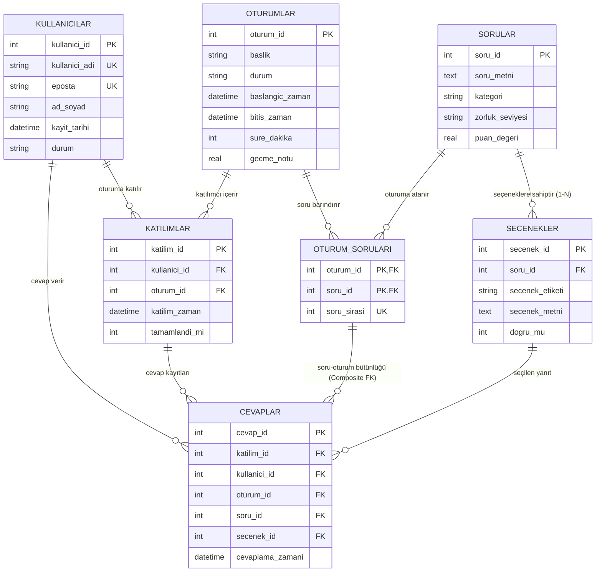

# 📚 SQLite ile Quiz Veri Tabanı Projesi

**Ders:** Veri Tabanı Sistemleri  
**Veri Tabanı Motoru:** SQLite3  

🌐 **Canlı Web Arayüzü (Streamlit):** `https://db-quiz-project.streamlit.app/`  

---

## 🚀 Hızlı Kurulum ve Çalıştırma Adımları

### 1. Veri Tabanını Oluşturma ve Seed Verisi Yükleme
Aşağıdaki komut `schema.sql` şemasını yükler ve **60 Kullanıcı**, **5 Oturum**, **110 Soru** (440 Seçenek ile), **120 Oturum-Soru Ataması**, **97 Katılım** ve **1767 Cevap** kaydını `quiz.db` dosyasına yazar:

```bash
python seed.py
```

### 2. Veri Bütünlüğü ve Kısıtlama Testlerini Çalıştırma
FOREIGN KEY, UNIQUE, CHECK ve Bileşik FK kısıtlamalarının doğru çalıştığını doğrular (8/8 Test Geçer):

```bash
python test_integrity.py
```

### 3. Canlı Takip Paneli ve Web Arayüzünü Lokal Çalıştırma)
Streamlit interaktif dashboard ve sınav simülatörünü kendi bilgisayarınızda başlatmak için:

```bash
pip install -r requirements.txt
streamlit run streamlit_app.py
```

---

## 📐 Veri Modeli ve İlişkiler (ER Diyagramı)



---

## 🛠️ Mimari ve Tasarım Kararları (Neden Bu Yapı?)

### 1. Sorular ve Seçeneklerin Ayrılması (3NF Normalize Yapı)
- **Sorun:** Soruların seçeneklerini aynı tablo içinde `secenek_a`, `secenek_b`, `secenek_c`, `secenek_d` kolonları halinde tutmak 1NF/2NF ihlaline yol açar ve esnek değildir.
- **Çözüm:** `secenekler` tablosu ayrıştırılarak **1-N ilişkisi** kurulmuştur. Bu sayede bir soru 2 seçenekli (True/False), 4 seçenekli veya 10 seçenekli olabilir. Veri tekrarı önlenmiş ve alan tasarrufu sağlanmıştır.

### 2. Bileşik Yabancı Anahtar (Composite Foreign Key) İle Oturum Bütünlüğü
- **Gereksinim:** *"Bir cevabın, sorunun gerçekten yer aldığı oturuma ait olmasını sağlayın."*
- **Çözüm:** `cevaplar` tablosuna `(oturum_id, soru_id)` bileşik sütunu eklenmiş ve bu sütun `oturum_sorulari(oturum_id, soru_id)` tablosuna **Composite Foreign Key** olarak bağlanmıştır.
- **Sonuç:** Kullanıcı Oturum 1'deyken, Oturum 2'ye ait bir soruya cevap vermeye çalışırsa SQLite veritabanı seviyesinde `FOREIGN KEY constraint failed` hatası vererek işlemi reddeder!

### 3. SQLite Foreign Key Denetimi
SQLite varsayılan olarak geriye dönük uyumluluk nedeniyle Foreign Key denetimini kapalı tutar. Tüm bağlantılarda ve DDL/DML betiklerinde ilk komut olarak:
```sql
PRAGMA foreign_keys = ON;
```
çalıştırılarak veritabanı kısıtlamaları aktif kılınmıştır.

---

## 📊 Puanlama Kuralı ve Boş/Yanlış Cevap Değerlendirmesi

Sistemde dinamik puanlama kuralı uygulanmıştır:
1. **Doğru Cevap:** Sorunun `puan_degeri` kadar puan eklenir (Örn: +10 Puan).
2. **Yanlış Cevap:** Yanlış cevap ceza puanı düşürür (Örn: -2.5 Puan).
3. **Boş / Cevaplanmamış Soru:** 0 Puan olarak değerlendirilir.
4. **Geçti / Kaldı Durumu:** Kullanıcının aldığı net puan, oturumun `gecme_notu` değerine (Örn: 50.0 Puan) eşit veya büyükse `PASSED (BAŞARILI)`, aksi halde `FAILED (BAŞARISIZ)` hesaplanır.

---

## 📈 Kayıt Sayıları ve Hedef Doğrulama

Sistem kurulduktan sonra aşağıdaki sayısal hedefler elde edilmiştir:

| Metrik / Tablo | Proje Asgari Hedefi | Gerçekleşen Kayıt | Durum |
| :--- | :--- | :--- | :--- |
| **Kullanıcı Kayıt Sayısı** | En az 50 | **60 Kayıt** | ✅ BAŞARILI |
| **Oturum Sayısı** | 5 Oturum | **5 Oturum** | ✅ BAŞARILI |
| **Benzersiz Soru Sayısı** | En az 100 | **110 Soru** | ✅ BAŞARILI |
| **Seçenek Kayıt Sayısı** | Esnek (3NF) | **440 Seçenek** | ✅ BİLGİ |
| **Oturum-Soru Ataması** | Soru-Oturum Eşlemesi | **120 Atama** | ✅ BİLGİ |
| **Katılım Kayıt Sayısı** | Oturum Katılımları | **97 Katılım** | ✅ BİLGİ |
| **Kullanıcı Cevap Sayısı** | Cevaplama Akışı | **1767 Cevap** | ✅ BİLGİ |

---

## 🎓 Proje Mülakatı ve Sözlü Sınav Hazırlık Rehberi (9 Ekim Cuma)

Hocanızın sözlü sınavda sorabileceği muhtemel sorular ve cevapları:

### S1: Neden SQLite kullandınız ve `PRAGMA foreign_keys = ON;` neden önemlidir?
> **Cevap:** Proje isterlerinde SQLite kullanılması istenmiştir. SQLite gömülü (file-based) bir veritabanı olduğu için istemci-sunucu mimarisine ihtiyaç duymaz. Ancak SQLite varsayılan olarak yabancı anahtar (FK) kısıtlamalarını denetlemez. Bu nedenle veri bütünlüğünü korumak için her bağlantı kurulduğunda `PRAGMA foreign_keys = ON;` komutunu çalıştırmak şarttır.

### S2: Soruların seçeneklerini neden ayrı bir tabloda tuttunuz?
> **Cevap:** Soruları ve seçenekleri aynı tabloda tutmak veritabanı normalizasyon kurallarına (1NF/2NF) aykırıdır. `secenekler` tablosunu ayırarak **1-N (One-to-Many)** ilişki kurduk. Bu sayede hem veri tekrarını önledik, hem de ileride 2 seçenekli (Doğru/Yanlış) veya 10 seçenekli sorular eklendiğinde tablo yapısını değiştirmeden esnek bir mimari elde ettik.

### S3: Bir cevabın, sorunun gerçekten o oturumda yer alıp almadığını nasıl kontrol ettiniz?
> **Cevap:** `cevaplar` tablosundaki `(oturum_id, soru_id)` sütun çiftine **Composite Foreign Key (Bileşik Yabancı Anahtar)** tanımlayarak bu çifti `oturum_sorulari(oturum_id, soru_id)` birincil anahtarına bağladık. Eğer bir soru ilgili oturuma atanmamışsa, SQLite veritabanı seviyesinde `FOREIGN KEY constraint failed` hatası vererek hatalı cevabı engeller.

---

## 📁 Teslim Edilen Dosya Yapısı

- 📄 `schema.sql`: Tüm DDL komutları, tablolar, kısıtlar, indeksler ve görünümler.
- 🐍 `seed.py`: 60 kullanıcı, 5 oturum, 110 soru, seçenekler ve örnek cevapları oluşturan veri yükleme betiği.
- 📊 `queries.sql`: Canlı takip, puan hesaplama, liderlik tablosu ve analitik SQL sorguları.
- 🛡️ `test_integrity.py`: Veri bütünlüğü ve kısıtlama testlerini çalıştıran doğrulama betiği.
- 🎨 `streamlit_app.py`: Streamlit ile hazırlanmış modern interaktif dashboard ve sınav simülatörü.
- 📦 `requirements.txt`: Streamlit Cloud yayını ve bağımlılık dosyası.
- 🗄️ `quiz.db`: Hazır çalışan SQLite veritabanı dosyası.
- 📘 `README.md`: Proje dokümantasyonu.
